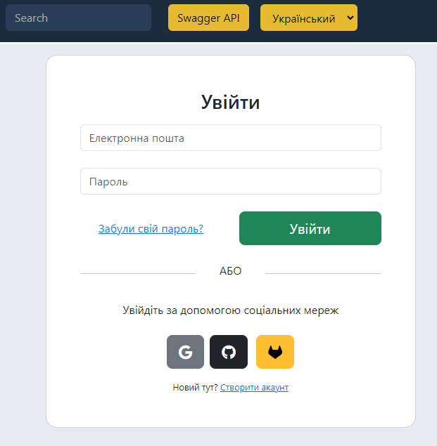
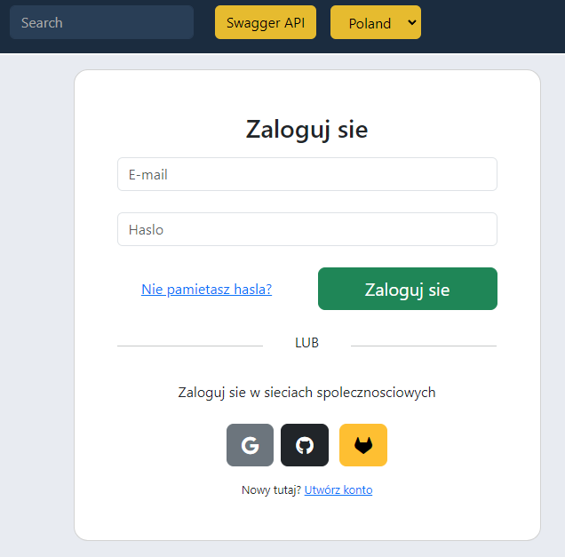

## [REST API](http://localhost:8080/doc)

## Концепция:

- Spring Modulith
    - [Spring Modulith: достигли ли мы зрелости модульности](https://habr.com/ru/post/701984/)
    - [Introducing Spring Modulith](https://spring.io/blog/2022/10/21/introducing-spring-modulith)
    - [Spring Modulith - Reference documentation](https://docs.spring.io/spring-modulith/docs/current-SNAPSHOT/reference/html/)

```
  url: jdbc:postgresql://localhost:5432/jira
  username: jira
  password: JiraRush
```

- Есть 2 общие таблицы, на которых не fk
    - _Reference_ - справочник. Связь делаем по _code_ (по id нельзя, тк id привязано к окружению-конкретной базе)
    - _UserBelong_ - привязка юзеров с типом (owner, lead, ...) к объекту (таска, проект, спринт, ...). FK вручную будем
      проверять

## Аналоги

- https://java-source.net/open-source/issue-trackers

## Тестирование

- https://habr.com/ru/articles/259055/

Список выполненных задач:
...
1. Розібратися зі структурою проєкту (onboarding). +
2. Видалити соціальні мережі: vk, yandex. +


3. Винести чутливу інформацію до окремого проперті файлу. +


4. Переробити тести так, щоб під час тестів використовувалася in memory БД (H2), а не PostgreSQL. +


5. Написати тести для всіх публічних методів контролера ProfileRestController. +


6. Зробити рефакторинг методу com.javarush.jira.bugtracking.attachment.FileUtil#upload. +
7. Додати новий функціонал: додавання тегів до завдання (REST API + реалізація на сервісі). +
8. Додати підрахунок часу: скільки завдання перебувало у роботі та тестуванні. Написати 2 методи на рівні сервісу, які параметром приймають завдання та повертають витрачений час -
9. Написати Dockerfile для основного сервера +
10. Написати docker-compose файл для запуску контейнера сервера разом з БД та nginx. - 
11. Додати локалізацію мінімум двома мовами для шаблонів листів (mails) та стартовою сторінки index.html. +




